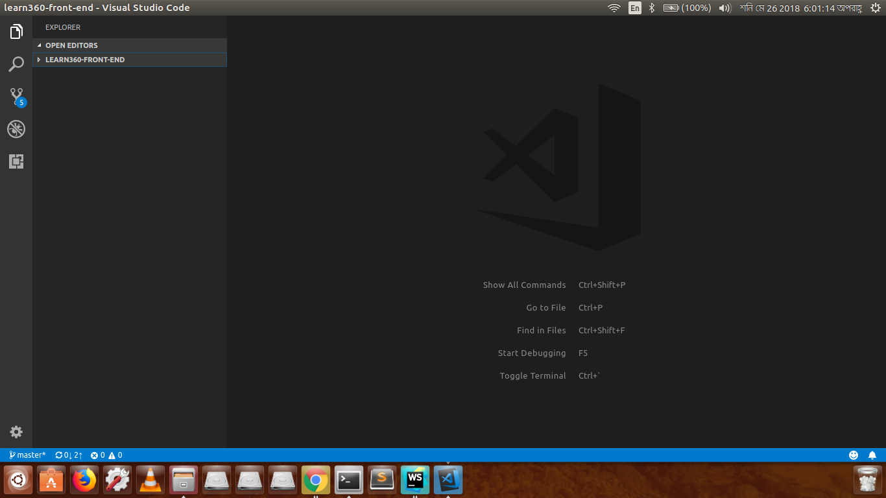
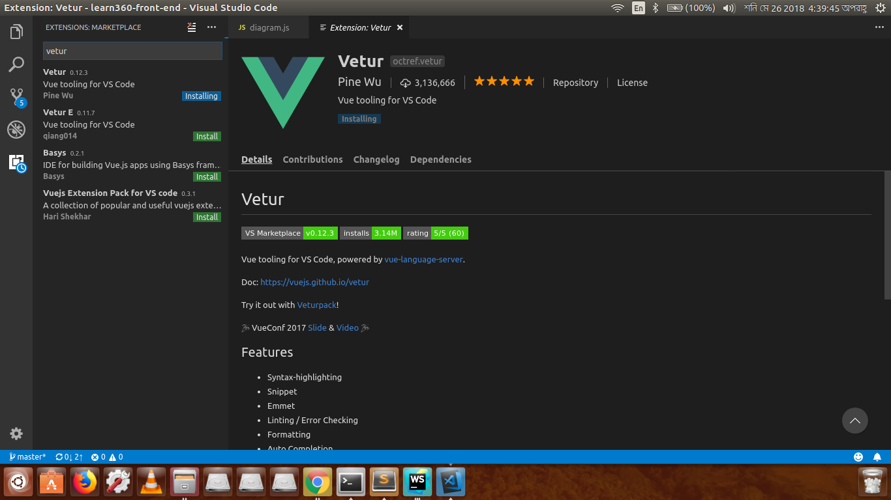
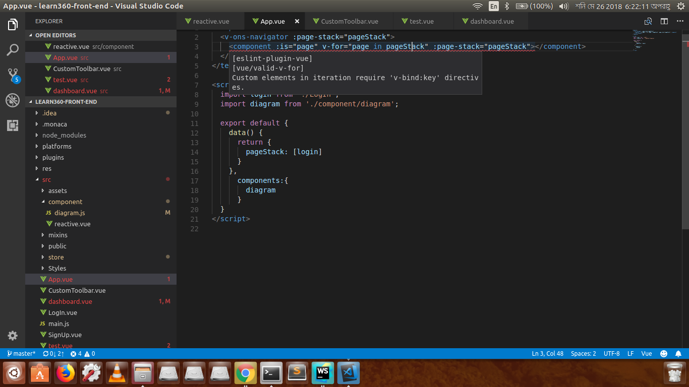
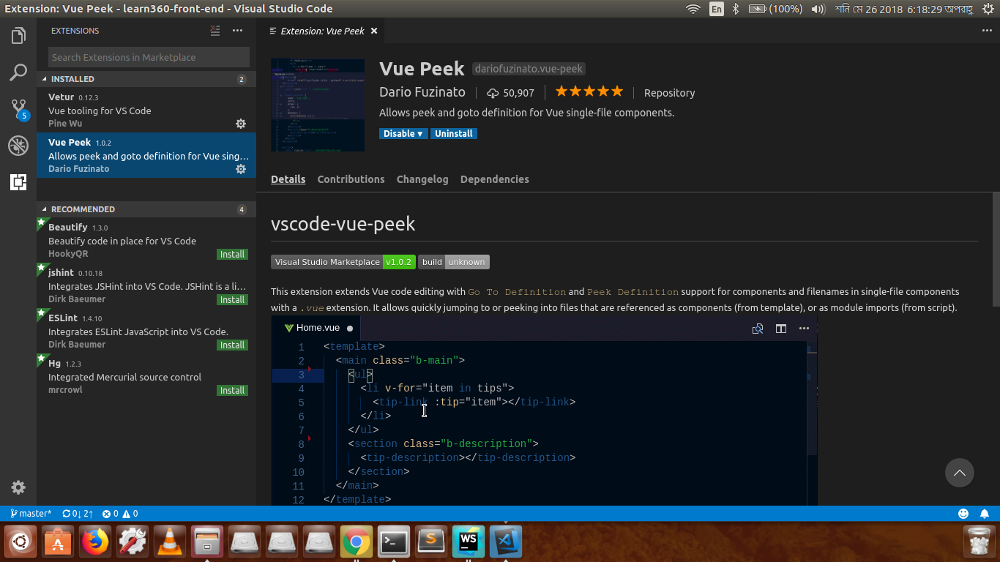
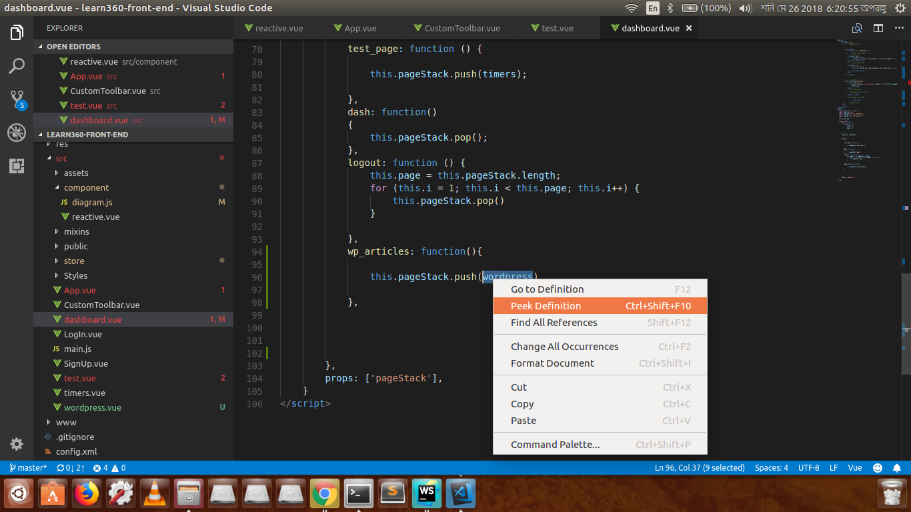
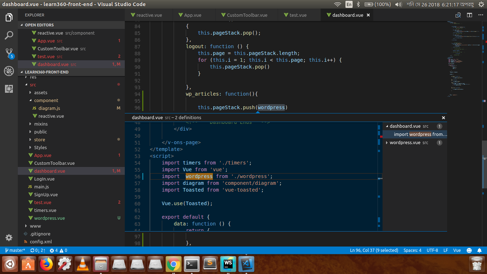

# Tools
[[toc]]

We have discussed about all the terms we need to install VuePress, Now it's time to talk about how we can develop our custom themes easily or generate static site based on the default theme, That is when we need tools. There are several tools we have available.<br>
But we will talk how we can develop our code using <strong> Visual Studio Code </strong> <br>
## Visual Studio Code

To Download it <strong>Windows</strong>, <strong> Linux </strong> and <strong> Mac </strong> users can follow the link below </br>
[Visual Studio](https://code.visualstudio.com/download)


To install through command line for Linux (Ubuntu) users can follow the following code

```
sudo apt install snapd-xdg-open
sudo snap install vscode --classic
```
After that to start visual studio you just type
```
vscode
```


Now to work with VuePress we need to install some extensions so that they can help us writing code with more fun,error free and make our development related tasks stress free.
We will talk about two extensions.
<p> <strong> Vetur </strong>
<p> <strong> Vue peek </strong>

## Vetur

This is the extension we are talking about. This extension has the following features
<div>
<ul>
<li><strong> Syntax-highlighting </strong> </li>
<li><strong> Snippet </strong> </li>
<li> <strong>Emmet </strong> </li>
<li><strong> Linting / Error Checking </strong> </li>
<li><strong>Formatting </strong> </li>
<li><strong>Auto Completion </strong></li>
<li><strong>Debugging </strong> </li>

</ul>
</div>

Here is an example of <strong>Syntax Highlighting</strong> and <strong>Linting </strong><br>


You can install it by going to <strong>extension </strong> in <strong> Visual Studio Code </strong> <br>
you can get details about this extension from this link.<br>
[Vetur](https://vuejs.github.io/vetur/)

Another extension is <strong>Vue Peek </strong>
## Vue Peek
 <br><br><br>
What Vue peek does is that it find the definition for us like the following images.<br><br>
 <br><br><br>
We need to select the <strong> Go TO Definition </strong> or <strong> Peek definition </strong>. And it will display the definition instantly. <br><br>
 <br>
You can install it just like Vetur by going to <strong>extension </strong> in <strong> Visual Studio Code </strong> <br>
and to know abou it in details here is a github link <br>
[Vue Peek](https://github.com/fuzinato/vscode-vue-peek)

